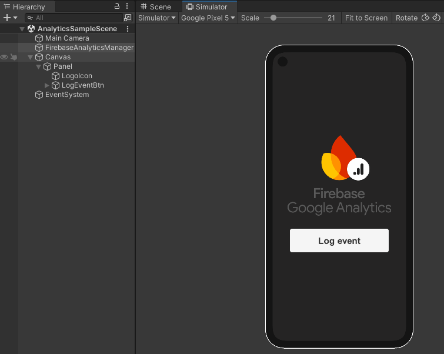

# Firebase Analytics Sample: Log Event

This sample contains:

- `FirebaseAnalyticsManager` game object attached with a sample script that handle the **`FirebaseApp`** initialization.

- A **scene** file [AnalyticsSampleScene.unity](./Scenes/AnalyticsSampleScene.unity) with a button click  
that logs a simple event on Analytics cloud dashboard

Use this sample here as a *"**Getting Started**"*, to understand how to use **Firebase Analytics** with Unity and check if the
cloud comunication is working properly outside of your project. This is useful if your game project is large, with several scripts
and files to recompile on each change!

## Screenshots

## Getting started

1. From Unity Editor, open the scene file [AnalyticsSampleScene.unity](./Scenes/AnalyticsSampleScene.unity)
2. Generate a mobile build (Android or IOS), install and run in your device
   > **Warning:** For now, Deskto/WebGL builds aren't working with Analytics.

   > If you try press *"**Play**"* button on Editor, it will try use the `mobilesdk_app_id`, `project_id` etc.. from **`/Assets/StreamingAssets/google-services-desktop.json`** generated file,
   but the events aren't being logged on Analytics cloud :(
